# M-Pesa Fraud Detection ML Platform


## Project Highlights

- Built an end-to-end M-Pesa fraud detection platform using Kafka, PostgreSQL, FastAPI, MLflow, and Docker
- Simulated realistic transaction streams across 58 Kenyan cities
- Engineered 20 fraud features spanning behavioral, temporal, velocity, and amount patterns
- Added model monitoring, prediction logging, and drift detection
- Automated testing and CI validation using GitHub Actions

An end-to-end ML platform for near real-time fraud detection on M-Pesa transactions. This project demonstrates production-style data engineering across streaming ingestion, feature engineering, model training, API serving, drift monitoring, and automated testing, built with a Kenyan fintech context using realistic M-Pesa transaction types, Kenyan names, KES amounts, and location data across 58 Kenyan cities.

---

## Platform Preview

**Streamlit Dashboard**


**MLflow Experiment Tracking**


**FastAPI Interactive Docs**


---

## Business Problem

M-Pesa processes millions of financial transactions daily. Fraud patterns, including velocity attacks, account takeovers, and suspicious high-value transfers, evolve continuously and require automated detection systems that can score transactions in near real time.

This platform detects:

- Unusual spending behaviour relative to a sender's historical baseline
- Rapid transaction bursts within short time windows
- Account takeover signals via new device and new location combinations
- Statistically extreme amounts using z-score analysis

---

## Architecture

The platform is built in 8 layers, each feeding the next:



---

## Tech Stack

| Layer | Technology |
|---|---|
| Streaming | Apache Kafka 7.4.0, confluent-kafka 2.6.1 |
| Database | PostgreSQL 18, SQLAlchemy 2.0.36, psycopg2 2.9.11 |
| Feature Engineering | Python 3.13, Pandas 2.2.3 |
| Machine Learning | scikit-learn 1.5.2, XGBoost 2.1.3, imbalanced-learn 0.12.4 |
| Experiment Tracking | MLflow 2.18.0 |
| API Serving | FastAPI 0.115.5, Uvicorn 0.32.1, Pydantic 2.10.3 |
| Drift Monitoring | scipy 1.17.1 (KS test + chi-squared test) |
| Dashboard | Streamlit 1.40.2 |
| Containerisation | Docker, Docker Compose |
| Testing | pytest 8.3.4 |
| CI | GitHub Actions |

---

## Project Structure

```
mpesa-fraud-detection/
|-- src/
|   |-- ingestion/
|   |   |-- schema.py           # MpesaTransaction dataclass
|   |   |-- producer.py         # Kafka transaction generator
|   |   `-- consumer.py         # Kafka to PostgreSQL writer
|   |-- features/
|   |   |-- feature_pipeline.py # Orchestrator
|   |   |-- temporal_features.py
|   |   |-- velocity_features.py
|   |   |-- amount_features.py
|   |   |-- behavioral_features.py
|   |   `-- feature_store.py
|   |-- training/
|   |   |-- train.py            # Main training script
|   |   |-- data_loader.py
|   |   |-- models.py
|   |   |-- evaluate.py
|   |   |-- register_model.py
|   |   `-- label_generator.py
|   |-- api/
|   |   |-- main.py             # FastAPI entry point
|   |   |-- schemas.py
|   |   |-- model_loader.py
|   |   |-- prediction_logger.py
|   |   |-- batch_scorer.py
|   |   `-- routes/
|   |       |-- predict.py
|   |       |-- health.py
|   |       |-- metrics.py
|   |       `-- model_info.py
|   |-- monitoring/
|   |   |-- monitor.py          # Orchestrator
|   |   |-- drift_detector.py
|   |   `-- alert_logger.py
|   `-- dashboard/
|       |-- app.py              # Streamlit entry point
|       `-- pages/
|           |-- live_feed.py
|           |-- model_metrics.py
|           `-- drift_report.py
|-- tests/
|   |-- test_features.py        # 13 tests
|   |-- test_model.py           # 6 tests
|   `-- test_api.py             # 8 tests
|-- data/
|   `-- reports/                # HTML drift reports (auto-generated)
|-- .github/
|   `-- workflows/
|       `-- ci.yml              # GitHub Actions CI
|-- docker-compose.yml
|-- requirements.txt
`-- .env.example
```

---

## Database Schema

Five tables in PostgreSQL (`frauddb`):

**raw_transactions** - every transaction received from Kafka
- 14 columns: transaction_id, type, sender/receiver phone and name, amount, balance before/after, location, device_fingerprint, timestamp

**features** - one engineered feature row per transaction
- 20 features across 5 modules plus fraud label columns

**prediction_log** - every prediction made by the API
- transaction_id, fraud_probability, is_fraud, model_version, predicted_at

**drift_alerts** - drift results logged over time
- feature_name, drift_score, alert_level, detected_at

**model_registry_meta** - local record of champion model version

Indexes are created on `transaction_id`, `sender_phone`, and `timestamp` to improve time-window lookups used by velocity feature calculations.

---

## Feature Engineering

20 features engineered across 5 modules per transaction:

| Module | Features |
|---|---|
| Temporal | hour_of_day, day_of_week, is_night, is_weekend, is_month_start, is_month_end |
| Velocity | txn_count_last_10min, txn_count_last_1hr, txn_sum_last_10min, txn_sum_last_1hr |
| Amount | amount_zscore, amount_vs_sender_mean, is_large_amount |
| Behavioral | is_new_device, is_new_location, unique_receivers_last_1hr, type_frequency |
| Identity | amount, transaction_type (passed through to model) |

**Velocity** features query `raw_transactions` for each sender's recent history within rolling time windows. **Amount** features compute a z-score by comparing the transaction amount against the sender's historical mean and standard deviation. **Behavioral** features detect account takeover signals: new device fingerprints, new locations, and high receiver diversity within one hour.

---

## Fraud Labeling

Labels are generated using rule-based weak supervision, a standard industry technique for bootstrapping ML labels without human-annotated ground truth data. A transaction is labeled as a fraud if 2 or more of the following rules fire:

| Rule | Signal |
|---|---|
| Night (00:00-04:59) + amount > 3x sender mean | Suspicious timing and amount |
| 5+ transactions in last 10 minutes | Velocity attack |
| New device AND new location simultaneously | Account takeover |
| Amount z-score > 3.0 | Statistically extreme amount |
| Amount > KES 50,000 + new device | High-value unknown device |
| 4+ unique receivers in last 1 hour | Fund distribution pattern |

Every rule is documented. Every label includes the rules that fired, producing an auditable label trail.

**Results on 339 transactions:**
- Fraud: 34 (10.0%)
- Legitimate: 305 (90.0%)

---

## ML Training

The focus of this project is end-to-end systems engineering, not benchmark model performance. Labels were derived from the same behavioral signals because labels are generated from rules sharing information with model inputs, evaluation scores are influenced by target leakage and should not be interpreted as real-world predictive performance. All experiments are tracked in MLflow for full reproducibility.

Training data was split 80/20. SMOTE was applied to the training set to address class imbalance, upsampling the minority fraud class to match the majority class count. Three models were trained and compared:

- Logistic Regression
- Random Forest
- XGBoost

All experiments, parameters, and metrics are logged in MLflow. The champion model was selected and registered as `mpesa-fraud-detector v2` based on recall, prioritising fraud capture over false positive reduction.

---

## API Endpoints

FastAPI server on port 8000. Interactive docs at `http://127.0.0.1:8000/docs`.

| Endpoint | Method | Description |
|---|---|---|
| `/predict` | POST | Score a transaction, returns fraud_probability and is_fraud |
| `/health` | GET | Model load status and API health |
| `/metrics` | GET | Aggregate prediction statistics from prediction_log |
| `/model-info` | GET | Current model name and version |
| `/` | GET | Service info and endpoint list |

**Sample request:**

```bash
curl -X POST http://127.0.0.1:8000/predict \
  -H "Content-Type: application/json" \
  -d '{
    "transaction_id": "TXN-DEMO-001",
    "transaction_type": "Send Money",
    "sender_phone": "0712345678",
    "receiver_phone": "0798765432",
    "sender_name": "Grace Njeri",
    "receiver_name": "Amina Wanjiku",
    "amount": 75000.00,
    "sender_balance_before": 80000.00,
    "sender_balance_after": 5000.00,
    "location": "Nairobi CBD",
    "device_fingerprint": "DEV-NEW-UNKNOWN-001",
    "timestamp": "2026-05-19T03:15:00"
  }'
```

**Sample response:**

```json
{
  "transaction_id": "TXN-DEMO-001",
  "fraud_probability": 1.0,
  "is_fraud": true,
  "model_version": "latest",
  "message": "FRAUD DETECTED"
}
```

---

## Drift Monitoring

The monitoring pipeline compares two datasets using statistical tests:

- **Reference data:** earliest 70% of labeled features (training window)
- **Current data:** most recent 200 predictions from prediction_log

**Tests used:**
- Kolmogorov-Smirnov (KS) test for numerical features
- Chi-squared test for boolean features

**Alert thresholds:**
- score >= 0.25: HIGH
- score >= 0.10: MEDIUM
- score < 0.10: OK

**Results from first monitoring run (339 transactions):**

| Feature | Drift Score | Alert Level |
|---|---|---|
| is_weekend | 1.0000 | HIGH |
| is_large_amount | 0.2496 | MEDIUM |
| hour_of_day | 0.2250 | MEDIUM |
| day_of_week | 0.1150 | MEDIUM |
| amount | 0.0835 | OK |
| txn_count_last_10min | 0.0042 | OK |
| amount_zscore | 0.0000 | OK |

HTML drift reports are saved to `data/reports/` on each run.

---

## Test Suite

27 tests across 3 files, 0 failures.

```
tests/test_features.py    13 tests   feature engineering correctness
tests/test_model.py        6 tests   model loading and prediction validity
tests/test_api.py          8 tests   API endpoints, validation, error handling
```

Run locally:

```bash
pytest tests/ -v
```

GitHub Actions CI runs `tests/test_features.py` automatically on every push to `main` using an isolated PostgreSQL service container, confirming feature engineering correctness in a clean environment with each change.

---

## M-Pesa Transaction Types

The producer generates 7 transaction types weighted by real-world frequency:

| Type | Weight | Amount Range (KES) |
|---|---|---|
| Send Money | 30% | 50 - 70,000 |
| Buy Goods | 25% | 20 - 15,000 |
| Pay Bill | 15% | 100 - 50,000 |
| Withdraw | 10% | 100 - 70,000 |
| Pochi la Biashara | 8% | 10 - 5,000 |
| Airtime Purchase | 7% | 5 - 1,000 |
| Lipa na Mpesa | 5% | 50 - 30,000 |

Traffic volume adjusts by hour of day: LOW (00:00-05:59), HIGH (07:00-08:59 and 17:00-18:59), MEDIUM (all other hours).

---


## Quick Start

```bash
git clone https://github.com/Brian-10-star/mpesa-fraud-detection.git
cd mpesa-fraud-detection

docker-compose up -d

python src/ingestion/producer.py
python src/ingestion/consumer.py

python src/training/train.py
```

## Setup and Running

**Environment:** Tested on Windows 11 with WSL2 (Ubuntu). Python scripts run from PowerShell on Windows. PostgreSQL is installed on the Windows host.

### Prerequisites

- Python 3.13
- PostgreSQL 18
- Docker Desktop

### 1. Clone and install

```bash
git clone https://github.com/Brian-10-star/mpesa-fraud-detection.git
cd mpesa-fraud-detection
pip install -r requirements.txt
```

### 2. Configure environment

```bash
cp .env.example .env
# Edit .env with your PostgreSQL credentials
```

### 3. Create the database

```bash
psql -U postgres -c "CREATE DATABASE frauddb;"
```

### 4. Start services

```bash
# Terminal 1: Kafka and Zookeeper
docker-compose up -d

# Terminal 2: MLflow tracking server
mlflow server --host 0.0.0.0 --port 5000

# Terminal 3: FastAPI
uvicorn src.api.main:app --host 0.0.0.0 --port 8000 --reload

# Terminal 4: Streamlit dashboard
streamlit run src/dashboard/app.py
```

### 5. Generate data and train

```bash
# Generate transactions (run producer and consumer simultaneously)
python src/ingestion/producer.py
python src/ingestion/consumer.py

# Engineer features
python src/features/feature_pipeline.py

# Generate fraud labels
python src/training/label_generator.py

# Train models
python src/training/train.py

# Score all transactions
python src/api/batch_scorer.py

# Run drift monitoring
python src/monitoring/monitor.py
```

---

## Key Engineering Decisions

**confluent-kafka over kafka-python:** kafka-python 2.0.2 has a known incompatibility with Python 3.13 (invalid file descriptor error on the selector). confluent-kafka 2.6.1 is the actively maintained library used in production Kafka deployments and is the correct choice for Python 3.13 environments.

**Weak supervision for labels:** No human-labeled fraud data exists for this dataset. Rule-based heuristics combining velocity, timing, and device signals are a standard industry technique for bootstrapping ML labels. Every rule is documented and every label includes the rules that fired, producing a fully auditable labeling pipeline.

**scipy over Evidently AI for drift detection:** Evidently 0.4.x through 0.5.x has a Pydantic v2 incompatibility on Python 3.13. The scipy KS test and chi-squared test are the same statistical methods Evidently uses internally, implemented directly with full control over thresholds and scoring logic. No functionality was lost.

**PostgreSQL as feature store:** Feast and dedicated feature stores are deferred. PostgreSQL provides ACID guarantees, complex SQL queries across feature history, and zero additional infrastructure for a single-node deployment.

**localhost over WSL IP for PostgreSQL:** Python scripts run on Windows where PostgreSQL is installed. Using localhost eliminates the dynamic WSL IP address that changes on every system restart, making the configuration stable across sessions.

**Kafka on port 9093:** Port 9093 was chosen to avoid conflict with an existing Kafka instance from a prior project running on port 9092.

---

## Author

**Brian Mbugua Chira**
BSc Computer Science, Egerton University (Expected 2028)
Nairobi, Kenya

Email: chirabrian1@gmail.com
GitHub: [github.com/Brian-10-star](https://github.com/Brian-10-star)
LinkedIn: [linkedin.com/in/mbuguabrian](https://www.linkedin.com/in/mbuguabrian)